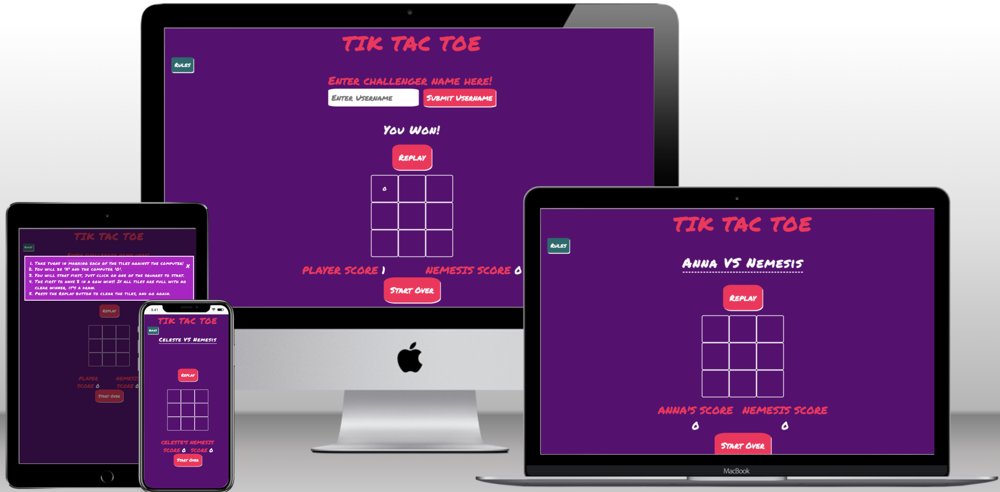
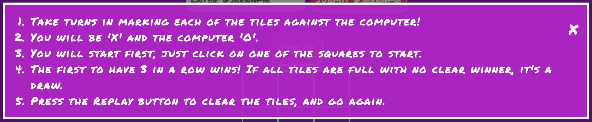
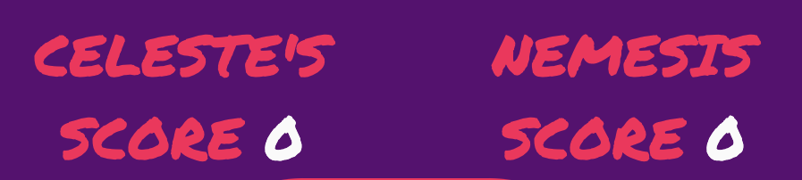
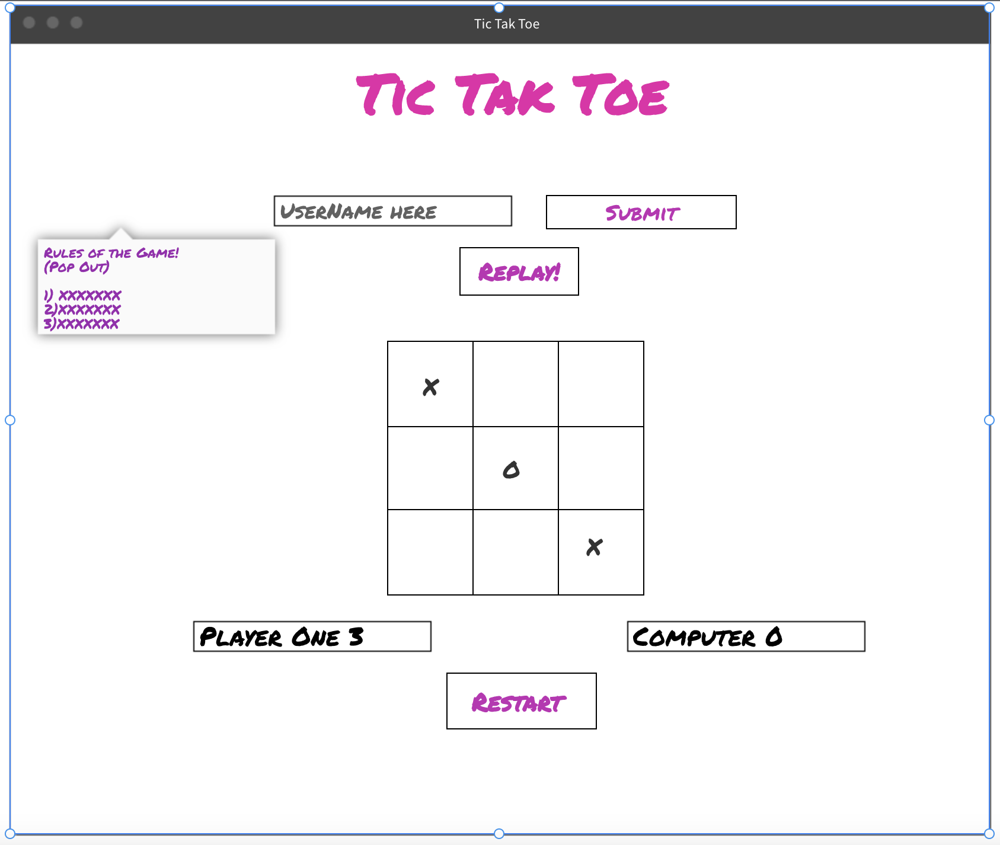
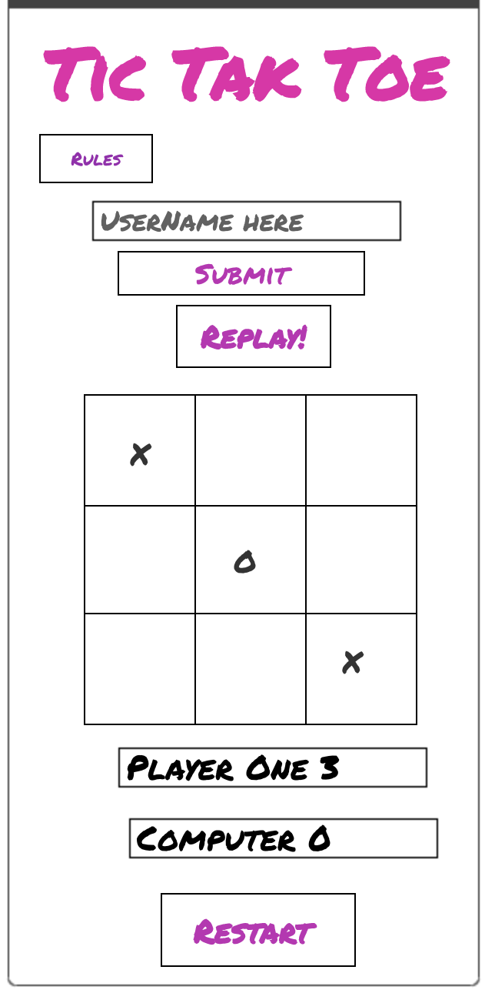
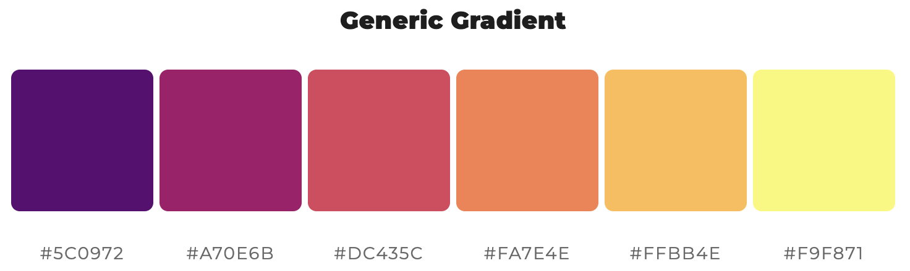
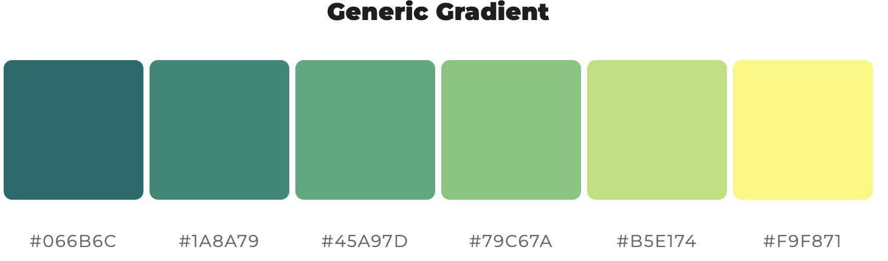
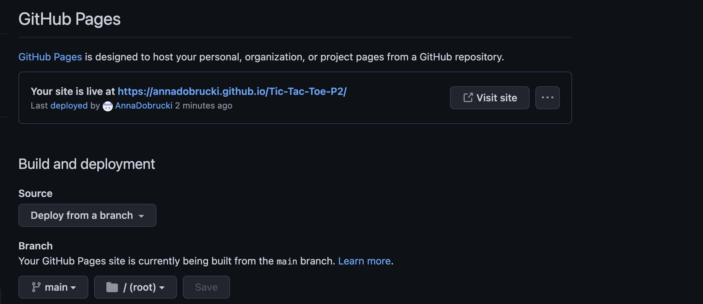

# Tic Tak Toe 
Welcome to the well known universal game of Tic Tak Toe! (or noughts and cross depending on your preference...)
As we all know Tic Tak Toe is one of the most common and well known games around the world, so it only felt natural to want to build one as part of my [Code Insitute Secondary Project.](https://codeinstitute.net/full-stack-software-development-diploma/)

## Index

* [Project Goals](#project-goals)
* [Features](#features)
* [Design](#design)
* [Testing](#testing)
* [Deployment](#deployment)
* [Credits](#credits)

## Project Goals

Having just done the walkthrough project of Love Maths within my studies at Code Institue, I found myself enjoying the idea of playing against a computer, with the possibilities of anything randomly happening wihtin the game itself. I therefore went with Tic Tak Toe (I also love that it's the game that bests the machine in War Games the movie.)

### User Goals
- Ease of use, with INSTANT recogntion of what the game was.
- If the user has never encounterered this game before, I wanted the rules/ instructions to be available to them straight off the bat.
- Create a username, linked to the scoreboard for added personalisation, potentially for the hope of returning use.
- Make sure children can use the site/game without supervision/ guidance.

## Features 
Key Features within this project:
- Whilst I have already mentioned Tic Tak Toe is a universally well known game, it doesn't mean people know how it works, so I also built a pop out (modal) for the rules to be explained should anyone like to learn or have a quick reminder! 

- To help people keep track of there score I installed a score counter for both the user and the computer. Whilst also storing the players username on the scoreboard.

- I built in a replay and re-start function/ button. The Start Over button reloads the original page, so that the user can re enter the username and start with a fresh win/loose counter. the Replay button is meant for kids, if theyre having a good win streak, they can see if theyre loosing and restart that round. I was told it wasn't necessary by one of the Code Insitute tutors, however my response was, that it reminded me of cheat codes with retro gaming, so I wanted to keep that in.

- In script.js I made the "nemesisGo" Function set with a timer, I had read about older computer games useing timers as a way to make the user think the computer had sentience due to the random amounts or time it took to have a go, so I placed a timer in to create that feel. 

## Design 
My version of Tic Tak Toe is based around children of ages 4+ being able to enjoy this game. 

### Wireframes
I wanted to have the Title front and foremost in the center, so people are drawn to the center of the page.
I realised early on that I wanted the grid to be the first thing you see. Which meant building the rest of my ideas around the center of the page. Hence the 'Replay' being at the top of the grid and the 'Start Over' button underneath the scoreboard.

I wanted the phone design to correspond with the laptop design, luckily because of the lack of clutter on the screen and centeral placement of most features it was easy to modify.

### Colour Scheme 
I recently found a teen book that gave me inspriation for this game's main colour scheme. Most of my prospective users are going to be 4+ I figured using bright colours with sharp white contract would be inviting for young children. 
I used [My Color Space ](https://mycolor.space/?hex=%23EA0661&sub=1) to get the Hex code I wanted, and went from there.

After some lighthouse testing my original idea for the color scheme had to change for accesability improvements. One main change was to my rules button, which is now using this gradient.

### Font
To me tic tak toe was always played at school, or at home with some sort of felt tip pen, so I went and found a font that gave that texture on the screen. Permenant Marker gives exactly that feel to this site thanks to [Google Fonts](https://fonts.google.com/)

## Testing

## Deployment 

I followed the steps through Github to deploy my site. 
Went to Github pages and selected my main branch and deployed my site.

