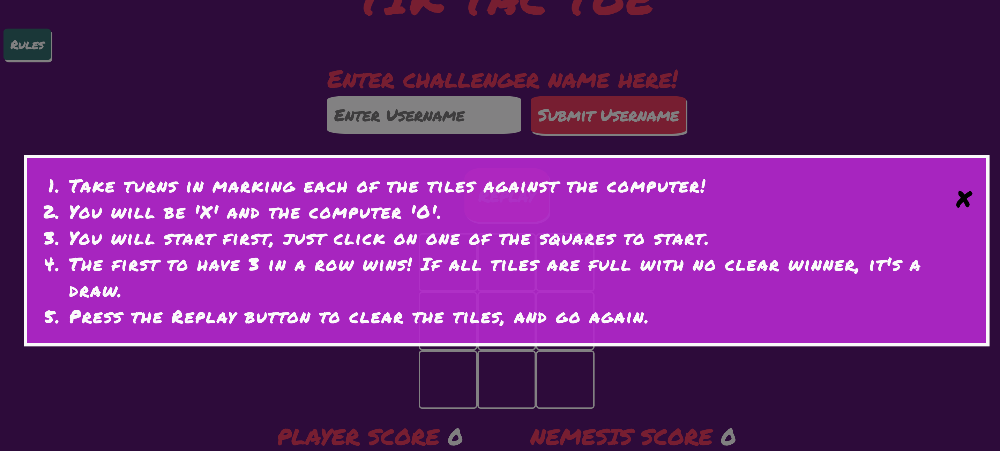
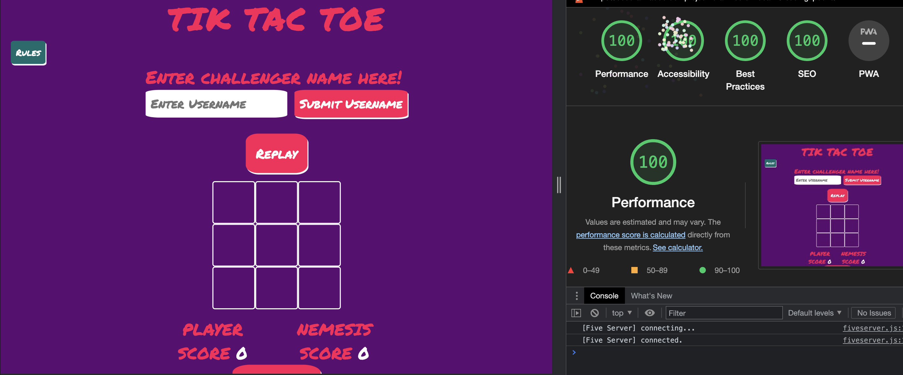
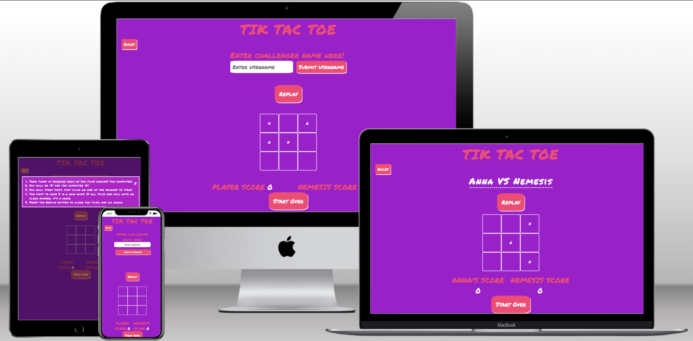
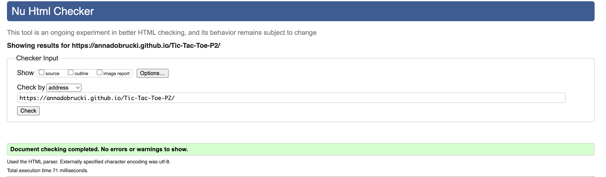
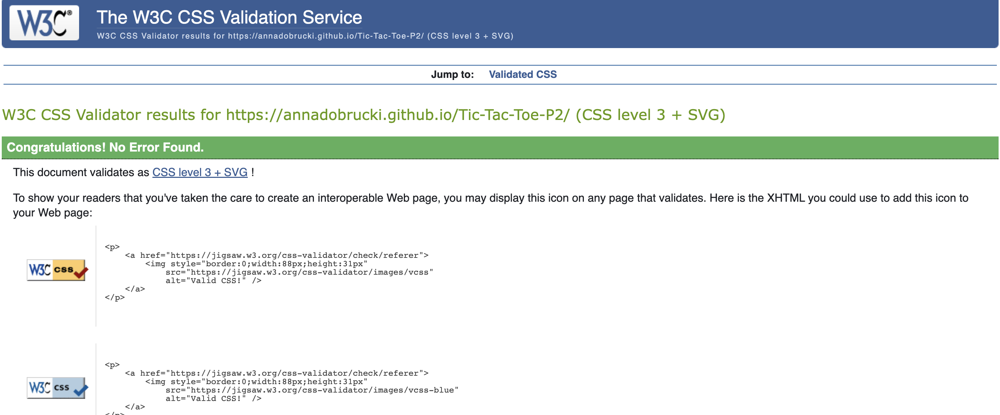
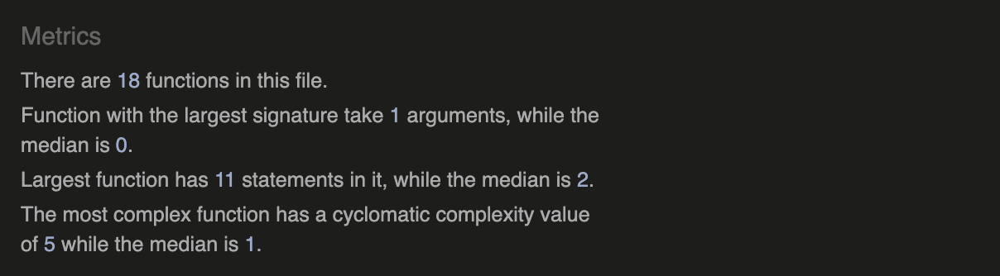

# Testing

## Index

 * [Error resolution and Debugging](#error-resolution-and-debugging)
 * [Responsiveness Testing](#responsiveness-testing)
 * [Lighthouse testing](#lighthouse-testing)
 * [HTML, CSS & JS Validation](#html-css-js-validation)

 ## Error Resolution and Debugging 
1. Originally building the game I hadn't built the nemesisGo function without the "do/ while" loop, which meant that when the "computer" went it was pick any box in the array from 0-8 (1-9) and overwriting whatever was in any cell. I had some help from one of the course tutors Ed who helped point me in the direction of the do/while loop, which helped fix this issue.

2. I encountered a problem where after every go "O" kept playing regardless of my conditional operator, with some help of some console.log's I foudn that I had written some code that was overwriting the operators, which I have since removed.

3. A problem I have fixed but not as I would like, was with the username input. If a user inputs spaces the alert pops up as planned, however after that there is a small glitch that seems to buffer afterwards. The writing of "VS NEMESIS" would pop up next to the username input after the alert, I have sinced create it to "display.none" afterwards, but does leave that split second of it popping up, before displaying just the username input section again.

 ## Manual testing

| Test Description (Modal)   | Expected Outcome | Actual Outcome |
| ----------- | ----------- | ----- |
| 'Click' on Rules modal     | The Rules should pop out above the whole page   | Pass
| 'Click' off rules modal | Click anywhere on the window should close modal  | Pass
| 'Click' on 'X' | Click on 'X' should close modal | Pass
| 'Click' on modal | Click anywhere on modal, should not close modal itself | Pass

| Test Description (Username Input)   | Expected Outcome | Actual Outcome |
| ----------- | ----------- | ----- |
| Write username into input section    | Should call an alert if only spaces are entered  | Pass
| 'Click Submit with no characters present | Should ask for the user to place a name in the input section before clicking submit  | Pass
| After name entered and submit clicked| The username input should be removed from users view | Pass
| After name entered and username input has been dismissed | Username should appear vs Nemesis in display area| Pass

| Test Description (Replay and Start Over Btns)   | Expected Outcome | Actual Outcome |
| ----------- | ----------- | ----- |
| 'Click' on Replay btn starts user as first to go    | Clears all cells, with 'X' to start  | Pass
| Replay should not reset Counter | Once replay clicked counter stays at current score   | Pass
| 'Click' on Start Over | Should reset the page back to original state and clear scores and username| Pass

| Test Description (Gameboard)  | Expected Outcome | Actual Outcome |
| ----------- | ----------- | ----- |
| 'Click' on any array/box fills space with user counter | "X" should be placed on any free cell  | Pass
| "O" should place counter after "X"| An "O" is placed randomly in free space following "X" | Pass
| 'Click' on 'X' or "O" | Should not change counter once filled| Pass
| Three in Row Win| Should all "X" be in a row then Winner is announced | Pass
| Three in Row Loose| Should all "O" be in a row then Nemesis is announced | Pass
| All boxes filled | Should all boxes be filled with no clear winner, a draw is announced | Pass
| After result restart new round | Old game should be cleared, ready for next| Pass
| "O" starts after "X" wins| "O" should be placed in a box after "X" won last round | Pass

| Test Description (Scoreboard)   | Expected Outcome | Actual Outcome |
| ----------- | ----------- | ----- |
| Username should be updated to scorebaord area | After username input player name chanes to username  | Pass
| Once user wins counter goes up ++ | Counter should reflect on games won next to username | Pass
| Once user looses Nemesis counter goes up ++ | Counter should reflect on games won by Nemesis | Pass

 ## Responsiveness testing 

  Dev tools was my go to for understanding my sites responisveness, and correcting media quieries. My site is responsive for the below:
   * iPhone SE
   * iPhone XR
   * iPhone 12 Pro
   * Pixel 5
   * Samsung Galaxy S8+
   * Samsung Galaxy S20 Ultra
   * iPad Air
   * iPad Mini
   * Surface Pro 7
   * Surface Duo
   * Samsung Galaxy A51
   * Nest Hub Max
 
 ## Lighthouse Testing 

 Using the Dev tools feature of lighthouse testing I got these results:

I had orginally had a different type of colour scheme for the site, however after using lighthouse I drastically changed it from it's orginal below.

 ## HTML, CSS & JS Validation
 ### HTML

 [Index.html - press here to live link](https://validator.w3.org/nu/?doc=https%3A%2F%2Fannadobrucki.github.io%2FTic-Tac-Toe-P2%2F)

 ### CSS
I used the [W3C Validation Service](https://jigsaw.w3.org/css-validator/#validate_by_input) to validate all CSS3 code used.

 [style.css - press here to live link](https://jigsaw.w3.org/css-validator/validator?uri=https%3A%2F%2Fannadobrucki.github.io%2FTic-Tac-Toe-P2%2F&profile=css3svg&usermedium=all&warning=1&vextwarning=&lang=en)

 

    

 ### Javascript

 Through-out coding with javascript I constantly used [JS Hint](https://jshint.com/)
The final draft of my script.js came back with no errors, and warnings all relating to the version of javascript available. It also returned this 

 
